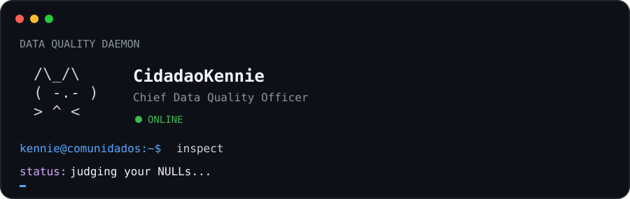

<div align="center">

# `betina@comunidados:~$ whoami`

### Data Scientist · Forecasting · Time Series · Retail AI

`Python` · `SQL` · `R` · `Spark` · `Databricks` · `GCP` · `CatBoost` · `Time Series`

</div>

```text
betina@comunidados:~$ ./about

role       Data Scientist
focus      Forecasting · Time Series · Machine Learning · Retail
building   analytical systems that connect prediction to decision
studying   statistics · causal inference · probabilistic forecasting
```

## `~/work`

I work at the intersection of statistics, analytical engineering and decision-making.

My main interests are demand forecasting, temporal validation, hierarchical forecasting, probabilistic models, causal inference and the translation of model performance into business decisions.

> Model uncertainty. Explain evidence. Build decisions.

## `~/stack`

| Layer | Tools & methods |
|---|---|
| Languages | Python · SQL · R |
| Forecast & ML | CatBoost · LightGBM · ARIMA · ETS · Prophet · Foundation Models |
| Data | Pandas · NumPy · Spark · Databricks · BigQuery |
| Cloud & orchestration | GCP · Airflow |
| Decision & explainability | SHAP · Simulation · Optimization · Scenario Analysis |
| Visualization | Power BI · Tableau · Streamlit |

## `~/projects`

### Data Science Workbench
Methodological infrastructure for data science projects, agents, documentation and reproducible analytical workflows.

### ComuniDados
Independent writing about data, artificial intelligence, technology and society.

## `~/principles`

```text
01  preserve temporal order
02  prevent leakage
03  compare against meaningful baselines
04  quantify uncertainty
05  make assumptions explicit
06  build reproducible analyses
07  treat data quality as part of the model
```

## `$ sudo ./data-quality-check`

<p align="center">
  
</p>

<div align="center">

[`ComuniDados`](https://betinaschilling.github.io) · [`GitHub`](https://github.com/betinaschilling)

</div>
