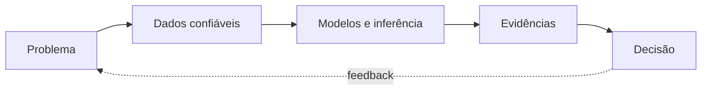

  

  <a href="https://betinaschilling.github.io">ComuniDados</a>
  ·
  <a href="https://github.com/betinaschilling/data-science-workbench">Data Science Workbench</a>

Trabalho na interseção entre estatística, engenharia analítica e decisão. Meu foco é transformar dados temporais, sistemas complexos e incerteza em evidências que possam ser examinadas, explicadas e utilizadas.

> Modelar incerteza. Explicar evidências. Construir decisões.

## Sistema de trabalho

Previsão não é causalidade. Explicabilidade não é prova. Métrica sem decisão é apenas um número bem-comportado.

## Focos técnicos

- Forecasting e séries temporais — demanda, receita, hierarquias, backtesting e incerteza.
- Estatística e causalidade — regressão, experimentação, inferência bayesiana e desenho de estudos.
- Machine learning — modelos supervisionados, segmentação, validação e explicabilidade.
- Engenharia analítica — SQL, qualidade, pipelines, Spark, Databricks e reprodutibilidade.
- Sistemas de decisão — simulação, otimização e tradução de evidências para negócio.

## Projetos vivos

| Projeto | Propósito |
|---|---|
| [Data Science Workbench](https://github.com/betinaschilling/data-science-workbench) | Laboratório técnico com projetos, agentes, métodos e habilidades portáveis para diferentes LLMs. |
| [ComuniDados](https://betinaschilling.github.io) | Caderno de investigação sobre dados, tecnologia, pesquisa e capacidade de interpretação. |

## Ferramentas

`Python` · `SQL` · `R` · `Pandas` · `Statsmodels` · `Scikit-learn` · `CatBoost` · `LightGBM` · `Spark` · `Databricks` · `BigQuery` · `Airflow` · `Power BI`

## Princípios

- preservar a ordem temporal e impedir vazamento;
- separar descrição, previsão, inferência, causalidade e prescrição;
- comunicar magnitude, incerteza, limitações e risco;
- construir análises reproduzíveis e decisões auditáveis;
- democratizar dados distribuindo capacidade de interpretação.

  <a href="https://betinaschilling.github.io"><i>Compreender dados é uma forma de participar.</i></a>

