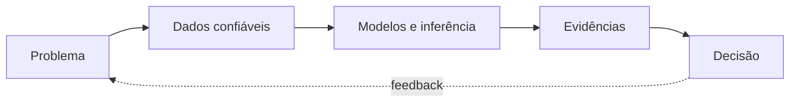

  

  <a href="https://github.com/betinaschilling/data-science-workbench">Data Science Workbench</a>
  ·
  <a href="https://betinaschilling.github.io">ComuniDados</a>

Trabalho na interseção entre estatística, engenharia analítica e decisão. Meu foco é transformar dados temporais, sistemas complexos e incerteza em evidências que possam ser examinadas, explicadas e utilizadas.

> Modelar incerteza. Explicar evidências. Construir decisões.

## Sistema de trabalho

| Etapa | Verificação técnica | Entrega para decisão |
|---|---|---|
| Problema | Decisão, população, unidade de análise, target ou estimando, horizonte e critérios de sucesso. | Pergunta verificável e definição explícita de valor. |
| Dados confiáveis | Granularidade, chaves, cobertura, qualidade de mensuração, disponibilidade point-in-time e leakage. | Base analítica rastreável, semanticamente correta e adequada ao uso. |
| Modelos e inferência | Baseline, pressupostos, loss, particionamento, validação temporal ou por grupos, ajuste e complexidade. | Alternativas comparáveis e desempenho estimado em condições realistas. |
| Evidências | Generalização fora da amostra, calibração, estabilidade, incerteza, heterogeneidade e sensibilidade. | Benefícios, limites e riscos apresentados na escala da decisão. |
| Decisão | Custo dos erros, thresholds, restrições operacionais, responsabilidade, monitoramento e feedback. | Recomendação proporcional à evidência, com critérios de acompanhamento. |

O ciclo não termina na entrega do modelo: decisões produzem resultados, novos dados, riscos e perguntas melhores.

## Especialidades

- Forecasting e séries temporais — demanda, receita, hierarquias, reconciliação, backtesting e previsões probabilísticas.
- Estatística e causalidade — regressão, experimentação, inferência bayesiana, desenho de estudos e análise de sensibilidade.
- Machine learning — modelos supervisionados e não supervisionados, feature engineering, calibração, explicabilidade e validação.
- Engenharia analítica — modelagem de dados, SQL, qualidade, pipelines, Spark, Databricks, BigQuery e reprodutibilidade.
- Sistemas de decisão — simulação, otimização, cenários e tradução de evidências para negócio.

## Aplicações de negócio

| Contexto | Contribuição analítica |
|---|---|
| Planejamento de demanda | Forecasts temporais e hierárquicos, cenários e quantificação da incerteza. |
| Comercial, marketing e pricing | Segmentação, avaliação de impacto, elasticidades, sinais de demanda e priorização. |
| Gestão de risco e desempenho | Métricas calibradas, thresholds, stress tests e custo esperado dos erros. |
| Produtos de dados | Bases confiáveis, métricas governadas, modelos reproduzíveis e decisões monitoráveis. |

Um modelo não gera valor apenas por prever bem. Ele precisa chegar à decisão correta, no tempo necessário, com custo, risco e limitações compreendidos.

## Sistemas vivos

| Sistema | Função |
|---|---|
| [Data Science Workbench](https://github.com/betinaschilling/data-science-workbench) | Infraestrutura metodológica para projetos, agentes, documentação e habilidades portáveis entre diferentes LLMs. |
| [ComuniDados](https://betinaschilling.github.io) | Publicação independente sobre dados, inteligência artificial, tecnologia e sociedade. |

## Stack técnica

| Camada | Tecnologias e métodos |
|---|---|
| Análise e inferência | Python, Pandas, NumPy, SciPy, Statsmodels e inferência bayesiana. |
| Machine learning e forecast | Scikit-learn, CatBoost, LightGBM, ARIMA, ETS, Prophet, modelos fundacionais e validação walk-forward. |
| Dados e plataforma | SQL, Spark, Databricks, BigQuery, GCP, Airflow e modelagem dimensional. |
| Decisão e comunicação | Simulação, otimização, SHAP, análise de cenários, Power BI e Tableau. |

## Princípios

- preservar a ordem temporal e impedir vazamento;
- separar descrição, previsão, inferência, causalidade e prescrição;
- comparar contra baselines e simular o uso real;
- comunicar magnitude, incerteza, limitações e risco;
- construir análises reproduzíveis e decisões auditáveis;
- tratar qualidade como parte do processo, não como inspeção final.

  <a href="https://betinaschilling.github.io"><i>O código está aqui. As perguntas continuam no ComuniDados.</i></a>

